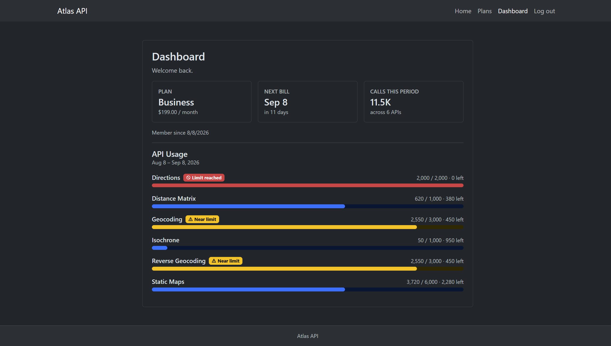
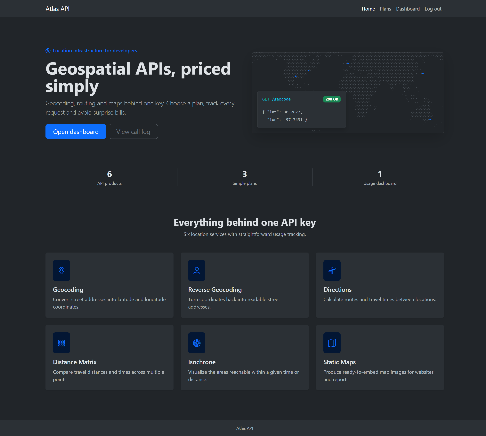
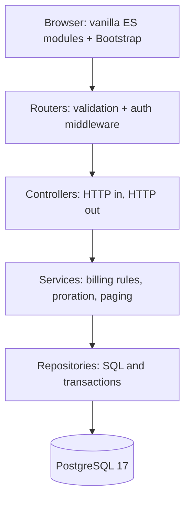
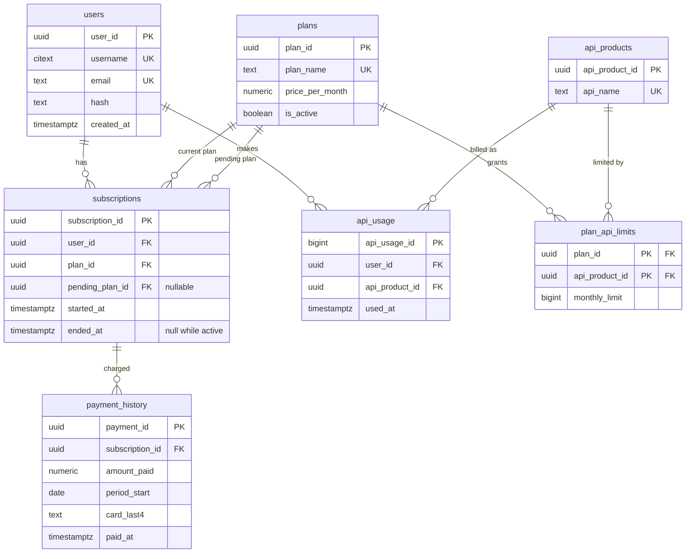

# Atlas API

A billing and metering backend for a fictional geospatial API company. Users register, pick a plan, get charged a prorated amount when they upgrade, and watch their monthly call quota fill up on a dashboard.


<!-- Worth replacing with a GIF eventually: choosing a plan, the prorated charge,
     landing on the dashboard with the receipt banner. A still cannot show that flow. -->

<p align="center">
  
</p>
<p align="center">
  <sub>Business plan, 20 days into a billing period, usage seeded across all six products.</sub>
</p>

<details>
<summary><b>More screenshots</b></summary>
<br>

</details>

| Layer | Technology |
| --- | --- |
| Runtime | Node.js 22, ES modules |
| API | Express 5 |
| Database | PostgreSQL 17 via postgres.js |
| Validation | Zod |
| Auth | argon2id hashing, JWT signed with jose, httpOnly cookies |
| Frontend | Vanilla ES modules, Bootstrap 5, no build step |
| Testing | Vitest, Supertest |
| Local infrastructure | Docker Compose |
| CI | GitHub Actions |

<!-- Once it is deployed, this line goes directly under the title, above the badges:

**Live demo:** https://your-app.example.com  ·  demo login: `demouser` / `demopass123`
-->

---

## What it does

- Register and log in. Passwords are hashed with argon2id, and the session is a signed JWT in an httpOnly cookie.
- Browse plans and subscribe. Free plans skip the card field entirely.
- Upgrade mid-period and pay a prorated difference for the days left in the billing period.
- Downgrade, which schedules the cheaper plan for the start of the next period instead of charging or switching immediately.
- Dashboard showing the current plan, next bill date, and a progress bar per API product with warning and limit-reached states.
- A paginated call log with filters by API product and date range.
- Billing history, plus the upcoming charge.

Card numbers never reach the database. The Zod schema slices the input down to the last four digits during validation, so the service layer only ever sees `4242`.
---

## Getting started

### Prerequisites

- Node.js 22 or newer
- Docker, for the PostgreSQL container

### Run it

```bash
git clone https://github.com/raycal49/processingTest.git
cd processingTest
npm install
cp .env.example .env      # defaults match compose.yml and work as-is
npm run setup             # starts Postgres and seeds plans, APIs, and a demo account
npm run dev
```
Alternatively, instead of entering `cp .env.example .env` into your terminal, you could simply rename `.env.example` to `.env`. You could also do this for the test section below. For example, instead of `cp .env.integration.example .env.integration` you could just rename `.env.integration.example` to `.env.integration`.

Then open http://localhost:3000 and log in as `demouser` / `demopass123`. That account sits on the Business plan, twenty days into a billing period, with usage seeded across all six API products at varying fill levels, so the dashboard has something to show. Progress bars land in the warning and limit-reached states rather than all sitting near zero.

`npm run setup` is `docker compose up -d --wait` followed by the seed. The schema is applied by Postgres itself on first boot from `docker/postgres/init/schema.sql`, mounted into the container's entrypoint directory. To reseed later, `npm run seed:usage:reset`.

The only value in `.env` which must be changed is `JWT_SECRET`:

```bash
node -e "console.log(require('crypto').randomBytes(32).toString('hex'))"
```

Set `DATABASE_LOG_QUERIES=true` to print every statement and its parameters.

### Tests

```bash
npm run test:run                # unit, no database needed
npm run db:integration:up       # test database, separate port and volume
cp .env.integration.example .env.integration
npm run test:integration
npm run db:integration:destroy  # tear it down
```
## Architecture



Each layer only knows the one below it. Nothing under `controllers/` touches `req` or `res`, and nothing under `services/` writes SQL, which is what makes the service layer testable with a plain object in place of the repository.

Wiring happens in one place. `container.js` builds every repository, service, controller, and router by hand and hands the result to `createApp()`. There is no DI framework. Each module exports a `createX(dependencies)` factory that closes over what it needs:

```js
const authRepo = createAuthRepository(sql);
const authServices = createAuthService(authRepo, jwtSecret);
const authController = createAuthController(authServices);
```

The payoff shows up in the tests. `testApp.js` calls the same container with a test database handle and a test signing key, so the integration suite exercises the real application object rather than a stand-in assembled for testing.

```
src/
  config/          database, jwt secret, cookie options
  container.js     composition root
  app.js           express factory
  server.js        http server, graceful shutdown
  routes/          route tables, validation and auth middleware attached here
  controllers/     status codes and response shapes
  services/        billing rules, proration, cursor paging
  repositories/    SQL, transactions, constraint-violation translation
  middleware/      auth, validation, central error handler
  schemas/         Zod request schemas
  errors/          typed errors carrying statusCode
  public/          static pages and browser modules
  views/           pages served behind auth
  scripts/         seed script
  tests/           unit and integration
docker/postgres/init/schema.sql
```

CI runs both suites on every push and pull request to `main`. The integration job stands up the same Compose file, copies the same committed env file so CI and a laptop cannot drift, and dumps database logs if anything fails.

## API

Everything is cookie-authenticated. Routes marked with a lock need a valid `token` cookie.

| Method | Route | What it does |
| --- | --- | --- |
| `POST` | `/auth/register` | Creates the user, sets both cookies, returns 201 |
| `POST` | `/auth/login` | Sets both cookies |
| `POST` | `/auth/logout` | Clears both cookies, redirects to the login page |
| `GET` | `/plans` | Active plans, cheapest first |
| `GET` | `/data` 🔒 | Dashboard payload: plan, pending plan, billing period, per-API limits and usage |
| `GET` | `/usage/log` 🔒 | Paginated call log. Query: `api_product_id`, `from`, `to`, `cursor_at`, `cursor_id` |
| `GET` | `/usage/apis` 🔒 | API products, for the filter dropdown |
| `GET` | `/payments/me` 🔒 | Payment history and the upcoming charge |
| `POST` | `/subscriptions` 🔒 | Subscribe or change plan. 201 when charged, 200 when scheduled |

Request bodies and query strings are validated by Zod schemas attached at the router, before a controller runs. Failures come back as a 400 with errors grouped by field name, which is what the forms render inline.

Errors are typed classes carrying a `statusCode`, and one middleware turns them into responses. A 401 from a browser navigation redirects to the login page, while a 401 from `fetch` returns JSON, decided by content negotiation on the `Accept` header.

---

## Design decisions

### Subscriptions and billing live in the schema



Two relationships between `plans` and `subscriptions` do most of the work here. `plan_id` is what the user is on now, `pending_plan_id` is what they have queued for next period, and `ended_at` being null is what makes a row the active one.

A subscription row has a `plan_id`, a nullable `pending_plan_id`, a `started_at`, and a nullable `ended_at`. Active means `ended_at IS NULL`. That gives the whole plan history for free, and a partial unique index does the enforcing:

```sql
CREATE UNIQUE INDEX one_active_subscription_per_user
    ON subscriptions (user_id) WHERE ended_at IS NULL;
```

Payments carry the same idea. `UNIQUE (subscription_id, period_start)` means one charge per subscription per period, so a double-submitted payment form cannot bill twice. Both indexes surface as `23505` unique violations, and `translateUniqueViolation` in the repository turns those into `AlreadySubscribedError` and `DuplicatePeriodPaymentError`, which the error middleware renders as a 409. Checking for these in JavaScript first would still leave a race between the check and the insert. This way the database makes the decision and the application only translates the answer.

Plan changes split on price. An upgrade charges right away, so `changePlan` ends the current subscription, opens a new one, and writes the payment inside a single `sql.begin` transaction. A downgrade or a lateral move only sets `pending_plan_id` and charges nothing, because the user already paid for the period they are in.

To be clear, there are no monthly payments. There is no scheduler, no cron, no worker. `next_bill_due` is computed on read as `period_start + interval '1 month'`, and `pending_plan_id` gets written but nothing ever comes along at the start of the next period to charge the card and promote the pending plan into place. The schema is shaped so that job would be straightforward to add, since it needs to find active subscriptions whose period has elapsed, insert a payment row for the new period, and swap the plan. Until that job exists, "monthly" is a claim the UI makes and the data model supports rather than something the system does on its own. Billing is a simulation throughout. No payment processor is involved, and any 13 to 19 digit number passes as a card.

### Cursor pagination on the call log

The usage log is the one table that grows without bound. A busy account on the Business plan generates thousands of rows a month, so the call log pages with a keyset cursor rather than `LIMIT/OFFSET`:

```sql
WHERE (used_at, api_usage_id) < (:cursor_at, :cursor_id)
ORDER BY used_at DESC, api_usage_id DESC
LIMIT 26
```

Two things made this worth doing over the simpler option. `OFFSET 500` still makes Postgres walk and discard 500 rows before returning anything. More importantly, the log is append-heavy at the top, so a user reading page three while new calls arrive shifts every offset underneath them and they see rows twice. A keyset cursor names a fixed position in the ordering instead of a count from the start, so new rows arriving above it change nothing.

The timestamp alone is not unique, since seeded rows routinely share a `used_at` down to the millisecond. The cursor is therefore the pair `(used_at, api_usage_id)`, compared as a row value, with the id breaking ties. The query also asks for `PAGE_SIZE + 1` rows and returns 25, using the presence of that extra row to decide whether to hand back a `next_cursor`. That avoids a second `COUNT(*)` query just to answer "is there more."

This design only pays off with an index that matches the sort:

```sql
CREATE INDEX api_usage_user_used_at_idx ON api_usage (user_id, used_at DESC);
```

That index exists for this one query. It is the reason the keyset comparison can seek straight to the cursor position instead of scanning, and without it the pagination scheme would be slower than the offset version it replaced. Worth stating plainly, because a cursor without a supporting index is cargo cult.

### JWT in an httpOnly cookie, and what that costs

Login signs an HS256 token with `jose` carrying only the user id, sets it in a cookie marked `httpOnly`, `sameSite=strict`, `path=/`, and `secure` when `NODE_ENV=production`, and expires it after an hour. Because it is httpOnly, no page script can read it, which is the point.

That creates a problem for the UI. The navbar needs to know whether to render "Log in" or "Dashboard" before any request goes out, and it cannot see the real token. So login also sets a second cookie, `signed_in=1`, that is deliberately readable. An inline script in the page head reads it and puts `auth-in` or `auth-out` on `<html>`, and two CSS rules hide the wrong set of links. The hint cookie is not a security boundary and can be forged by anyone with devtools. Forging it gets you a navbar with a Dashboard link and a 401 the moment you click it, because every protected route still verifies the real token server side.

The honest cost of stateless tokens is revocation. Logging out clears both cookies, which ends the session for that browser, but the token itself stays cryptographically valid until it expires. If one were copied out beforehand, it would keep working for up to an hour and nothing in this system can invalidate it. A short expiry limits the blast radius, which is why it is an hour and not a week. Fixing it properly means server-side session state, either a sessions table checked on each request or a denylist of revoked token ids, and at that point most of the appeal of stateless tokens is gone. For a single-server app this is a real trade rather than a free one, and I took the side that kept the auth path simple.

There is also no refresh token, so an active user is logged out an hour after login rather than after a stretch of inactivity.

### Tests run against real Postgres

The unit suite covers `userService`, where the billing rules live, with a hand-rolled mock repository and fake timers for the proration math. That is the right shape for that code, since proration is arithmetic against a clock and has no business touching a database.

Everything else runs against an actual Postgres container. Mocking was not an option for the parts I most wanted covered, because the partial unique index, the composite pagination index, and the `23505` translation are the behavior. A mocked `sql` would happily let a second active subscription through and prove nothing.

The setup is a second Compose file on its own port and volume, so the test database is never the dev database. `testDb.js` refuses to start unless `NODE_ENV=test` and the connection URL is exactly `127.0.0.1:55432/geoapp_test`, since it runs `TRUNCATE ... CASCADE` between every test and pointing that at the wrong database would be a bad afternoon. Files run serially, and every test starts from an empty schema and builds only the rows it needs through the fixture helpers.

## Known limitations

- Nothing recurs. No scheduler charges the next period or applies a pending plan change, as described above.
- Payments are simulated. No processor, and card validation only checks the shape.
- Tokens cannot be revoked before they expire, and there is no refresh, so sessions end an hour after login.
- Usage is seeded rather than metered. The API products are names in a table, not endpoints that count a call when you hit them.
- The frontend has no build step and no framework, so pages fetch on load and there is no client-side routing. That was deliberate at this size, but it is a ceiling.
- Not deployed anywhere yet. CI builds and tests; it does not ship.
- The schema ships as a single init file rather than versioned migrations, which works for a fresh container and would not survive a real deployment.

## What I would do next

Write the billing job that closes a period, charges the card, and promotes `pending_plan_id`, since that is the one piece of the model that is designed but not built. Move the schema onto real migrations. Add rate limiting to the auth routes. Then deploy it somewhere with a managed Postgres so the demo link is real.

## License

MIT
